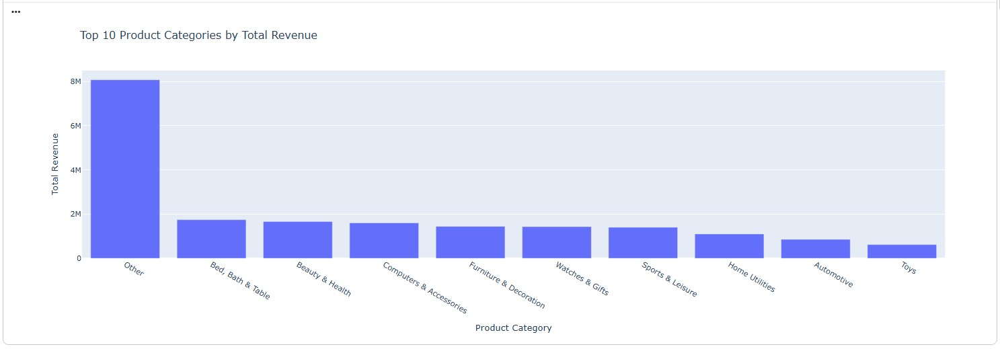
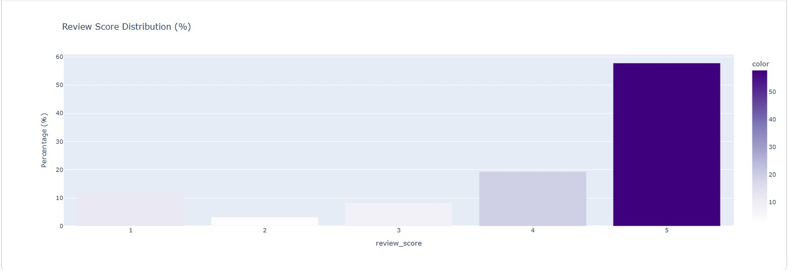

# Olist E-Commerce Orders Analysis

## Overview
This project analyzes the Olist e-commerce orders dataset using Python.  
The analysis focuses on sales trends, top-selling products, store performance, customer satisfaction, and revenue insights.  
Interactive visualizations are included, with static chart exports for GitHub display.

## Analysis Sections

### 1. Sales Trends
- Tracks total revenue and order count over time
- Calculates average order value (AOV) and return rates
- Highlights seasonal peaks and slow periods

### 2. Top-Selling Products & Categories
- Identifies most ordered products
- Visualizes top product categories by total revenue
- Translates category names into English for clarity

### 3. Customer Satisfaction & Delivery Analysis
- Measures delivery time distribution and delays
- Segments orders by delivery speed: Fast (≤7 days) vs Slow (>7 days)
- Analyzes satisfaction rates based on review scores
- Performs statistical comparison (t-test) to assess impact of delivery speed on satisfaction

### 4. Revenue by Satisfaction
- Examines total revenue generated per customer satisfaction level
- Highlights which products/categories contribute most to satisfied customers
- Correlates revenue with average review scores

### 5. Store Performance
- Compares store performance based on total orders, revenue, and satisfaction
- Highlights top-performing stores
- Identifies stores with frequent delivery delays or low satisfaction

## Key Metrics
- Total Revenue
- Total Orders
- Average Order Value (AOV)
- Delivery Days & Delays
- Customer Satisfaction Rate
- Top Products & Categories by Revenue and Satisfaction

## Tools & Technologies
- Python 3.x
- Pandas, NumPy
- Matplotlib, Seaborn, Plotly
- SciPy (for statistical analysis)
- Jupyter / Colab Notebook

## Files
- `olist_orders_analysis.ipynb` — Main analysis notebook
- `images/` — Static charts for GitHub display

## How to Use
1. Open the notebook in Colab:
 
(https://colab.research.google.com/drive/17sMAM4qyAbxSeyBrLRK3vuoFWUJ0iVOY?usp=sharing)

## Dashboard / Charts Preview

### Top 10 Product Categories by Total Revenue

### Delivery Time Distribution (Days)

### Review Score Distribution (%)

### Customer Satisfaction by Delivery Speed

### Average Review Score by Delivery Delay Group

### Top Categories by Customer Satisfaction Rate

### Total Revenue by Customer Satisfaction

